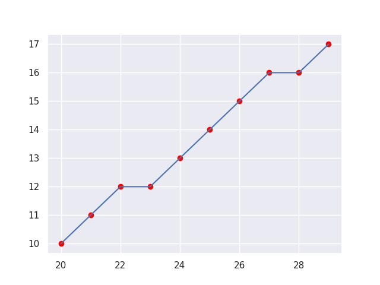

# Algoritmos de Computação Gráfica

Testes de implementação e estudos de algoritmos de computação gráfica com Python.

**As métricas de tempo para renderização são referentes ao seguinte hardware:**

- CPU: Intel i5-1135G7 (8) @ 4.2GHz
- GPU: Intel TigerLake-LP GT2 (Iris Xe Graphics)
- Memória: 16GB DDR4
- Sistema Operacional: Arch Linux (kernel Linux 6.8.7-arch1-1)
- Python: 3.11.8

## Algoritmo de Bresenham

O algoritmo de linha de Bresenham é um algoritmo de desenho de linha que determina os pontos de um raster n-dimensional que devem ser selecionados para formar uma grande aproximação de uma linha reta entre dois pontos. É comumente usado para desenhar linhas primitivas em uma imagem bitmap (por exemplo, na tela de um computador), pois usa apenas adição, subtração e mudança de bits de inteiros, todas operações muito baratas em arquiteturas de computador padrão. É um algoritmo de erro incremental. É um dos primeiros algoritmos desenvolvidos no campo da computação gráfica. Uma extensão do algoritmo original pode ser usada para desenhar círculos.

O algoritmo funciona de forma incremental, calculando os pixels a serem desenhados passo a passo. Ele se baseia na ideia de que um segmento de reta pode ser decomposto em uma série de pontos adjacentes na grade de pixels, considerando a inclinação da linha.

O algoritmo é usado em hardware como plotters e nos chips gráficos de placas gráficas modernas. Ele também pode ser encontrado em muitas bibliotecas gráficas de software. Como o algoritmo é muito simples, ele é geralmente implementado no firmware ou no hardware gráfico das placas gráficas modernas.

### Exemplo 1:

Entradas:
- `x1` = 20
- `y1` = 10
- `x2` = 30
- `y2` = 18

## Ray casting de Esferas 3D

O algoritmo de Ray casting recorre ao lançamento de raios a partir do observador de forma a perceber qual a distância que estão os objectos que compõem a cena. Tal como no Raytracing, os raios são emitidos a partir do observador, ou seja no sentido inverso do que acontece na natureza, a fim de poupar recursos computacionais. Se assim não fosse, o processamento seria incomportável e haveria grande desperdício de recursos, já que a maior parte dos raios de luz que partem da fonte de luz, não chegam ao observador.

O Ray casting é uma técnica que permite remover ou ignorar as superfícies escondidas numa imagem utilizando, para isso, as informações obtidas a partir das primeiras intersecções encontradas pelos raios lançados a partir do observador. 

Leia mais em: [Ray casting (Wikipedia)](https://pt.wikipedia.org/wiki/Ray_casting)

Os algoritmos de ray tracing de esferas 3D aqui presentes são baseados na playlist [Curso Básico de Python + Computação Gráfica](https://youtube.com/playlist?list=PL1YmAcaDZ1rNc01h3nKU0HNYktxOyRkqb&si=EEtRwCtJwoPqNDwl) no YouTube (autor desconhecido).
Seja quem for, muito obrigado por compartilhar o conhecimento ;)

### Exemplo 1:

Neste algoritmo foi implementado um exemplo de ray casting de esferas 3D, desenhando duas esferas uma maior (cor verde), outra menor (cor vermelha) sendo interceptadas pela esfera maior, e um plano de fundo (cor preta).

#### Teste 1 (sem iluminação na cena):

- Resolução da tela: `50x50 pixels`
- Tempo de renderização: `0.10s`

#### Teste 2 (sem iluminação na cena):

- Resolução da tela: `800x800 pixels`
- Tempo de renderização: `24.52s`

#### Teste 3 (com iluminação na cena):

- Resolução da tela: `800x800 pixels`
- Tempo de renderização: `43.13s`

#### Teste 4 (com brilho e mais uma esfera na cena):

- Resolução da tela: `800x800 pixels`
- Tempo de renderização: `68.23s`

