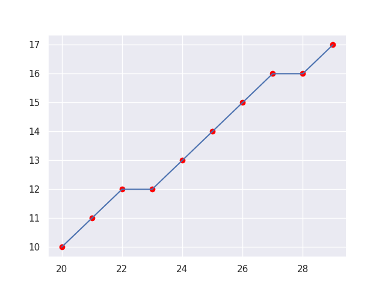

# Bresenham algorithm

O algoritmo de linha de Bresenham é um algoritmo de desenho de linha que determina os pontos de um raster n-dimensional que devem ser selecionados para formar uma grande aproximação de uma linha reta entre dois pontos. É comumente usado para desenhar linhas primitivas em uma imagem bitmap (por exemplo, na tela de um computador), pois usa apenas adição, subtração e mudança de bits de inteiros, todas operações muito baratas em arquiteturas de computador padrão. É um algoritmo de erro incremental. É um dos primeiros algoritmos desenvolvidos no campo da computação gráfica. Uma extensão do algoritmo original pode ser usada para desenhar círculos.

O algoritmo funciona de forma incremental, calculando os pixels a serem desenhados passo a passo. Ele se baseia na ideia de que um segmento de reta pode ser decomposto em uma série de pontos adjacentes na grade de pixels, considerando a inclinação da linha.

O algoritmo é usado em hardware como plotters e nos chips gráficos de placas gráficas modernas. Ele também pode ser encontrado em muitas bibliotecas gráficas de software. Como o algoritmo é muito simples, ele é geralmente implementado no firmware ou no hardware gráfico das placas gráficas modernas.

### Exemplo 1:

Entradas:
- `x1` = 20
- `y1` = 10
- `x2` = 30
- `y2` = 18

